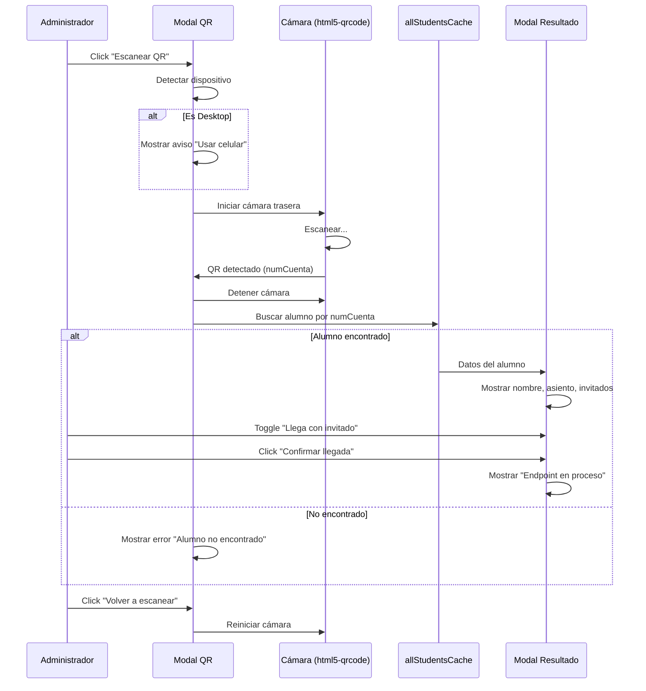

# Módulo de Escáner QR — FrontEnd

## Descripción

Crear un módulo independiente de escáner QR para el panel de administración, que permita escanear códigos QR de alumnos, mostrar su información en una modal y gestionar la confirmación de llegada (alumno + invitado). El módulo debe detectar si se está usando desde desktop o celular y recomendar el uso en móvil.

## User Review Required

> [!IMPORTANT]
> **Librería de escaneo QR**: Se usará [html5-qrcode](https://github.com/mebjas/html5-qrcode) vía CDN. Es la librería estándar para escaneo QR desde el navegador, no requiere instalación npm, y funciona directo con la cámara del dispositivo. ¿Estás de acuerdo?

> [!IMPORTANT]
> **Datos del QR**: El código QR contiene un **JWT único** generado por la API. Se decodifica el JWT para obtener el `numCuenta` del alumno y buscarlo en el `allStudentsCache` cargado en memoria.

> [!WARNING]
> **Endpoint de confirmación**: El botón "Confirmar llegada" abrirá una modal que dice "Endpoint en proceso", ya que actualmente `ControladorQr.php` tiene los métodos `generarQr()` y `validarQr()` como stubs vacíos. No se implementará lógica de backend en este plan.

## Proposed Changes

### Componente: Módulo QR (JavaScript)

Se crea un nuevo módulo JS siguiendo la estructura existente en `js/admin/modules/`.

---

#### [NEW] [qrscanner.js](file:///opt/lampp/htdocs/SistemaGestorDeAsientos/FrontEnd/js/admin/modules/qrscanner.js)

Módulo principal de escáner QR. Responsabilidades:

1. **Detección de dispositivo** (`isMobileDevice()`):
   - Usa `navigator.userAgent` + `navigator.maxTouchPoints` para detectar móvil/tablet vs desktop
   - Si es desktop: muestra un aviso dentro de la modal recomendando usar celular (pero no bloquea el uso)

2. **Inicialización del escáner** (`initQRScanner()`):
   - Usa `Html5Qrcode` para abrir la cámara trasera del dispositivo
   - Configura fps, tamaño de recuadro de escaneo
   - Al detectar un QR, llama a `onQRDetected(decodedText)`

3. **Procesamiento del QR** (`onQRDetected()`):
   - Detiene el escáner de cámara
   - Decodifica el JWT del QR para extraer el `numCuenta`
   - Busca el `numCuenta` en `state.allStudentsCache`
   - Si encuentra al alumno → abre la modal de resultados con los datos
   - Si no lo encuentra → muestra error en la modal

4. **Modal de resultados del alumno** (`showStudentResultModal(alumno)`):
   - Nombre completo del alumno
   - Asiento asignado (si tiene, si no se deja en blanco con texto "Sin asiento asignado")
   - Número de invitados autorizados
   - Toggle/checkbox para marcar si llega con invitado o no
   - Botón **"Confirmar llegada"** → abre una segunda mini-modal con mensaje "Endpoint en proceso"
   - Botón **"Volver a escanear"** → reinicia el escáner

5. **Cleanup** (`stopQRScanner()`):
   - Detiene la cámara y libera recursos al cerrar la modal

---

### Componente: Vista HTML (Modal QR en Admin)

---

#### [MODIFY] [view_admin.php](file:///opt/lampp/htdocs/SistemaGestorDeAsientos/FrontEnd/view_admin.php)

Cambios:
1. **Agregar CDN de html5-qrcode** antes del cierre de `</body>` (junto a los otros scripts)
   ```html
   <script src="https://unpkg.com/html5-qrcode@2.3.8/html5-qrcode.min.js"></script>
   ```

2. **Agregar Modal del Escáner QR** — nueva modal Bootstrap dentro del `dashboardView`:
   ```
   #qrScannerModal → Modal principal con:
     ├── #qrDesktopWarning → Aviso de usar celular (visible solo en desktop)
     ├── #qrReaderContainer → Contenedor donde html5-qrcode renderiza la cámara
     └── #qrScannerStatus → Texto de estado ("Escaneando...", "QR detectado", etc.)
   ```

3. **Agregar Modal de Resultado del Alumno**:
   ```
   #qrResultModal → Modal con datos del alumno:
     ├── #qrResultNombre → Nombre completo
     ├── #qrResultAsiento → Asiento (o "Sin asiento asignado")
     ├── #qrResultInvitados → Cantidad de invitados
     ├── #qrToggleInvitado → Switch/checkbox "¿Llega con invitado?"
     ├── #btnQrConfirmar → Botón "Confirmar llegada"
     └── #btnQrRescan → Botón "Volver a escanear"
   ```

4. **Agregar Modal de "Endpoint en Proceso"**:
   ```
   #qrEndpointModal → Mini-modal informativa
     └── Mensaje: "Endpoint en proceso" con ícono de desarrollo
   ```

5. **Modificar el botón "Escanear QR"** en la navbar (línea 115-117):
   - Cambiar el `onclick="alert(...)"` → enlazar con la función que abre `#qrScannerModal`

---

### Componente: Estilos CSS

---

#### [MODIFY] [admin.css](file:///opt/lampp/htdocs/SistemaGestorDeAsientos/FrontEnd/css/admin.css)

Agregar estilos para:
- `#qrReaderContainer` → contenedor de cámara con bordes redondeados, máximo ancho
- `#qrDesktopWarning` → alerta amarilla/informativa para el aviso de desktop
- `.qr-result-field` → filas de datos del alumno en la modal de resultado
- `.qr-toggle-invitado` → estilo del switch/toggle de invitado
- Media queries para que la modal QR ocupe pantalla completa en móvil (`fullscreen-sm-down`)

---

### Componente: Integración en app.js

---

#### [MODIFY] [app.js](file:///opt/lampp/htdocs/SistemaGestorDeAsientos/FrontEnd/js/admin/app.js)

Cambios:
1. Importar el nuevo módulo: `import { initQRModule } from './modules/qrscanner.js';`
2. Llamar `initQRModule()` dentro del `DOMContentLoaded` listener, después de verificar el token
3. Exponer globalmente `window.openQRScanner` si es necesario para el `onclick` del botón

---

## Arquitectura de Flujo



## Archivos Afectados (Resumen)

| Archivo | Acción | Descripción |
|---------|--------|-------------|
| `js/admin/modules/qrscanner.js` | **NUEVO** | Módulo completo de escáner QR |
| `view_admin.php` | MODIFICAR | Agregar 3 modals + CDN html5-qrcode + modificar botón |
| `css/admin.css` | MODIFICAR | Estilos para modals QR y responsive |
| `js/admin/app.js` | MODIFICAR | Importar e inicializar módulo QR |

## Open Questions

> [!IMPORTANT]
> **¿Qué contiene exactamente el QR?** ¿Es solo el número de cuenta del alumno como texto plano, o tiene otro formato (JWT token, URL, JSON string)?

> [!IMPORTANT]
> **¿Los datos de asiento ya están en el cache de alumnos?** En `table.js` la columna "Asiento" muestra un `-` hardcodeado. ¿La API actualmente devuelve el campo `asiento` en los datos del alumno, o aún no existe ese campo?

## Verification Plan

### Automated Tests
- Abrir `view_admin.php` en el navegador (desktop) → verificar que aparece el aviso de "usar celular"
- Abrir desde el navegador del celular → verificar que la cámara se abre correctamente
- Verificar que el botón "Escanear QR" en la navbar abre la modal del escáner
- Verificar que al cerrar la modal, la cámara se detiene y libera recursos

### Manual Verification
- Escanear un QR de prueba con un `numCuenta` válido → verificar que muestra los datos del alumno
- Probar el toggle de invitado → verificar que cambia el estado visual
- Probar el botón "Confirmar llegada" → verificar que muestra la modal "Endpoint en proceso"
- Probar el botón "Volver a escanear" → verificar que reinicia la cámara
- Verificar responsive: modal a pantalla completa en celular
